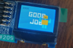

# Sound Display and Entertainment (SDE) system with **FPGA**

## 1. Overview

2 additional devices are used for the system:

* MEMs microphone (PmodMIC3): This analog-to-digital device will capture audio signals from the surroundings, and provides the data in a digital format.
* OLED RGB Display Screen (PmodMIC3): Information can be displayed on this 96 x 64 bit display screen with 16-bit colour resolution.

## 2. Features

### 2.1 Real-Time Audio Volume Indicator

sw[0] | Feature Description | Image
----- | ------------------- | -----
1 | Volume peak intensity is shown on the 16 LEDs. Volume level is shown on the 7-segments  display. | 
0 | mic_in is shown on the 12 LEDs | 

### 2.2 Graphical Visualisations and Configurations

To adjust border thickness:

sw[1] | sw[2] | Feature Description | Image
----- | ----- | ----- | -----
1 | 0 | 1 pixel | 
1 | 1 | 3 pixel | 

To show the volume bar according to the volume peak intensity, **sw[3] == 1**. To change colour scheme:

sw[4] | sw[5] | Feature Description | Image
 ----- | ----- | ----- | -----
0 | 0 | Colour scheme 1 | 
1 | 0 | Colour scheme 2 | 
1 | 1 | Colour scheme 3 | 

To freeze the volume bar, **sw[6] == 1**

### 2.3 IDLE Mode

If volume is constantly below level 5
volume for ~20 seconds, OLED will show
an image representing the 4 seasons
which changes every ~3 seconds
automatically.

To change season manually:
btnU | btnD | Feature Description
----- | ----- | -----
1 | \- | Next season
\- | 1 | Previous season

### 2.4 Name Indicator (Non-IDLE Mode)

To enable name indicator, **sw[0] == sw[7] == 1 && sw[10] == 0 && non-IDLE mode**

an[1:0] shows the volume level. an[3] shows letters (A to E) representing the name of the user, which will also be shown on the top left corner of the OLED screen simultaneously

To change UI of letter on OLED:
sw[4] | sw[5] | sw[8] | sw[9] | Feature Description
----- | ----- | ----- | ----- | -----
\- | \- | 1 | \- | Letter: Blue
\- | \- | 0 | \- | Letter: Red
\- | \- | \- | 1 | Shadow enabled (Default: White)
1 | 0 | \- | 1 | Shadow: Black

To change letter (A-E):
btnU | btnD | Feature Description
----- | ----- | -----
1 | \- | Next letter
\- | 1 | Previous letter

### 2.5 Hammer Game

To turn on game mode, **sw[10] == 1**

Firstly, the user will be able to choose the colour of the hammer using the middle button, **btnC**. There are 3-4 colours to choose from.

There are a total of 3 rounds, "LOW", "MED" and "HIGH". The user is required to produce a certain volume level as specified by the game within a time frame (which takes the max) and press **btnC** to hit the target. Once **btnC** is pressed, there will be animation of the user hitting the target and the volume bar will slowly move up until the maximum volume level achieved by the user within the time frame.

If it is within the range required, he proceeds to the next round.

Else, he will have to redo the round and lose a life. The lives remaining can be seen on the top left of the screen. If all 3 lives are used up, he will restart at the choosing hammer screen.

Once all 3 stages are completed, the user enters victory mode, where he is able to move and jump around using **btnU, btnD, btnL, btnR**.

To restart the game after completing, the user can hit **btnC**.
